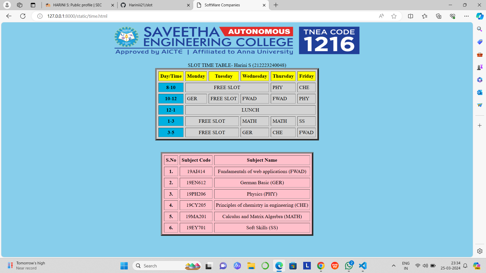

# Ex03 Time Table
## Date: 25.03.2024

## AIM
To write a html webpage page to display your slot timetable.

## ALGORITHM
### STEP 1
Create a Django-admin Interface.

### STEP 2
Create a static folder and inert HTML code.

### STEP 3
Create a simple table using ```<table>``` tag in html.

### STEP 4
Add header row using ```<th>``` tag.

### STEP 5
Add your timetable using ```<td>``` tag.

### STEP 6
Execute the program using runserver command.

## PROGRAM
```
<html>
	<head>
		<title>
			SoftWare Companies
		</title>
	</head>
	<body align="center" bgcolor="skyblue" >
		 <center>
            
         </center>
		<table align="center" border="5" cellspacing="6" cellpadding="5" bgcolor="lightgray">
			<caption>SLOT TIME TABLE- Harini S (212223240048) </caption>
            <br>
			<tr>
				<th bgcolor="yellow"> Day/Time </th>
				<th bgcolor="yellow"> Monday </th>
				<th bgcolor="yellow"> Tuesday </th>
                <th bgcolor="yellow"> Wednesday </th>
                <th bgcolor="yellow"> Thursday </th>
                <th bgcolor="yellow"> Friday </th>
			</tr>
			<tr>
				<th bgcolor="sky blue"> 8-10 </td>
                <td colspan="3" align="center"> FREE SLOT </td>
                <td> PHY </td>
                <td> CHE </td>
			</tr>
			<tr>
                <th bgcolor="sky blue"> 10-12 </th>
				<td> GER </td>
                <td> FREE SLOT </td>
                <td> FWAD </td>
                <td> FWAD </td>
                <td> PHY </td>
			</tr>
			<tr>
                <th bgcolor="sky blue"> 12-1 </th>
                <td colspan="6" align="center"> LUNCH </td>
			</tr>
			<tr>
                <th bgcolor="sky blue"> 1-3 </th>
                <td colspan="2" align="center"> FREE SLOT </td>
                <td> MATH </td>
                <td> MATH </td>
                <td> SS </td>
			</tr>
			<tr>
                <th bgcolor="sky blue"> 3-5 </td>
                <td colspan="2" align="center"> FREE SLOT </td>   
                <td> GER </td>
                <td> CHE </td>
                <td> FWAD </td>
			</tr>
			</table>
            <br>
            <table align="center" border="5" cellspacing="6" cellpadding="5" bgcolor="pink">
                <br>
                <tr>
                    <th align="center"> S.No </th>
                    <th align="center"> Subject Code </th>
                    <th align="center"> Subject Name </th>
                </tr>
                <tr>
                    <th align="center"> 1. </td>
                    <td align="center"> 19AI414 </td>
                    <td align="center"> Fundamentals of web applications (FWAD) </td>
                </tr>
                <tr>
                    <th align="center"> 2. </td>
                    <td align="center"> 19EN612 </td>
                    <td align="center"> German Basic (GER) </td>
                </tr>
                <tr>
                    <th align="center"> 3. </td>
                    <td align="center"> 19PH206 </td>
                    <td align="center"> Physics (PHY) </td>
                </tr>
                <tr>
                    <th align="center"> 4. </td>
                    <td align="center"> 19CY205 </td>
                    <td align="center"> Principles of chemistry in engineering (CHE) </td>
                </tr>
                <tr>
                    <th align="center"> 5. </td>
                    <td align="center"> 19MA201 </td>
                    <td align="center"> Calculus and Matrix Algerbra (MATH) </td>
                </tr>
                <tr>
                    <th align="center"> 6. </td>
                    <td align="center"> 19EY701 </td>
                    <td align="center"> Soft Skills (SS) </td>
                </tr>
                </table>
	</body>
</html>
```


## OUTPUT



## RESULT
The program for creating slot timetable using basic HTML tags is executed successfully.
